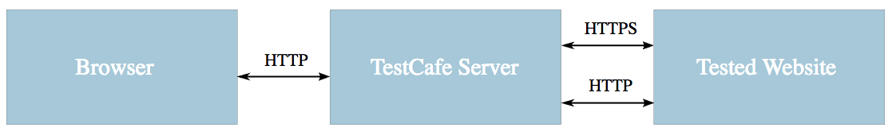

# Basic Usage
```npm install -g testcafe``` || ```npm install --save-dev testcafe```

```testcafe [options] <browser-list-comma-separated> <file-or-glob ...>

e.g. ```testcafe chrome tests/```

### (Maybe) Useful Options
```-s <path>, --screenshots <path>``` - Enables screenshots and specifies the base directory where they are saved
```-d, --debug-mode``` - Specify this optino to run in debuging mode (test execution is paused before the first action or assertion allowing you to invoke the developer tools and debug)
```-t <name>, --test <name>``` - Runs test with the specified name. 
&nbsp;&nbsp;&nbsp;&nbsp;&nbsp;&nbsp;```testcafe ie tests/sample-fixture.js -t "Click a label"``` Runs only the ```"Click a label"``` test from the sample-fixture.js file. Could use ``-T <patter>, --test-grep <pattern>``` to match a specified pattern.
```-debug-on-fail``` - Automatically enter the debug mode when a test fails
```-color``` - Add color

### 1
It is best not to bundle tests all together and mix deterministic and non-deterministic tests together. Martin Folwer
wrote a pretty good blog on it (ERADICATING Non-Determinism in Tests)[http://martinfowler.com/articles/nonDeterminism.html]

### 2
TestCafe is a proxy-based testing tool.
|  |
|-|

### 3
(Sending the output of the test to slack)[https://github.com/Shafied/testcafe-reporter-slack]

### 4
If eslint is used, to avoid the ```'fixtures' is not defined``` and ```'test' is not defined```, use (TestCafe plugin)[https://www.npmjs.com/package/eslint-plugin-testcafe]

### 5
Run ```testcafe --inspect-brk chrome ./tests``` to debug the application in Chome Developer Tools. 
Additionally, add the ```debugger``` keyword into the test code where you want it to stop.
Head to ```chrome://inspect``` and click on the Inspect link under the Remote Target section.

## Test API
### Fixtures
Tests are organized into categories called fixtures (a file can have one or more fixtures)
```fixture( fixture )``` || ```fixture \`fixture\````

### Tests
```test( testName, fn(t) )```, where ```t``` is a test controller use to access the test run API

### Hook Functions
Interesting bit - fixutre hooks are executed before the first test and after the last test finishes; fixture hooks are executed between test runs and thus do not have access to the tested page. ```fixture.before( fn(ctx) )``` and ```fixture.after( fn(ctx))```. ```ctx``` is used to share variables between fixute hooks and test hooks.
To access the fixture contexts from tests, use ```t.fixtureCtx``` property.

### Selectors and Actions
A selector is a function that identifies a webpage element in the test whereas an action is enables you to interact with the webpage.
Actions are implemented as methods on the test controller object.
Selectors provide methods and properties to select elements on the page and get their state.

